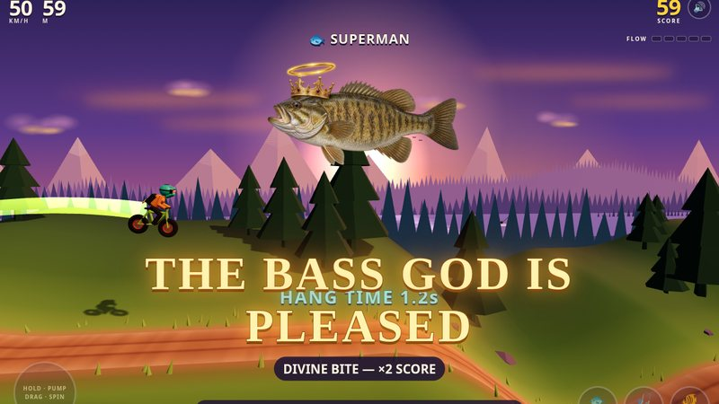
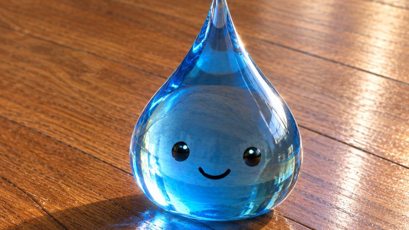
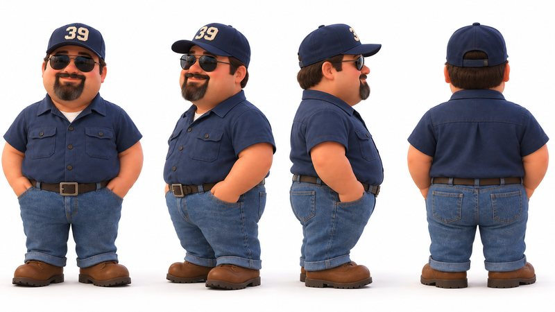
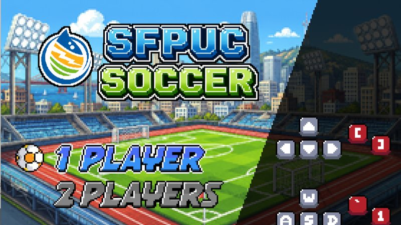
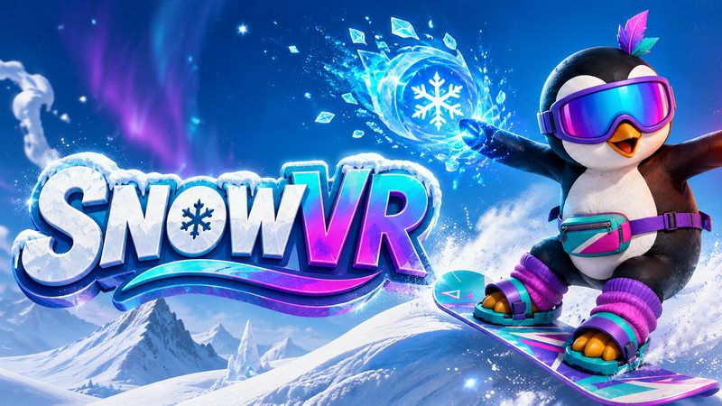

# BOXGames

Game demos and experiments. Small, playable, mostly-in-the-browser projects, each built with whatever suited it
(three.js, WebGPU, Godot, WebXR). There's no shared engine; every project stands on its own.

<table>
<tr>
<td width="50%" valign="top">

**PJ's Dirt Jumper** 
Over-the-top arcade slopestyle and pump track. Pump, pop, flip and grab, and the deeper you ride the weirder it
gets: the Bass God, Dad Bluegill's 1950s advice, a rocket-strapped pikeminnow that tows you through hyperspace.
Keyboard, touch or gamepad. 
**[Play](https://boxwrench.github.io/BOXGames/pj-dirt-jumper/)** · [Source](pj-dirt-jumper/) · Vite + TypeScript + three.js
</td>
<td width="50%" valign="top">

**Droppie** 
A tiny water droplet to poke at. Tap to hop, drag to stretch and throw. A small lab for real-time soft-body
physics, refraction, touch interaction and procedural audio. Needs a WebGPU browser. 
**[Play](https://boxwrench.github.io/Droppie/)** · [Source](https://github.com/boxwrench/Droppie) · WebGPU + three.js
</td>
</tr>
<tr>
<td width="50%" valign="top">

**Squish Crew** 
A mobile-first soft-body toy built on the Droppie engine: a round union-mascot bean-person in a cartoon boiler
room who grunts, squeals and sweats when you squish him. Needs a WebGPU browser. 
**[Play](https://boxwrench.github.io/squish-crew/)** · [Source](https://github.com/boxwrench/squish-crew) · WebGPU + three.js
</td>
<td width="50%" valign="top">

**SFPUC Super Soccer** 
Pixel-art arcade soccer for the SFPUC: Water, Power, Sewer and Hetch Hetchy face off in a solo tournament or
two-player local co-op and versus. Based on Nicolas Bize's MIT-licensed Godot soccer course. 
**[Play](https://boxwrench.github.io/SFPUC-Soccer/)** · [Source](https://github.com/boxwrench/SFPUC-Soccer) · Godot 4 (web + Windows)
</td>
</tr>
<tr>
<td width="50%" valign="top">

**SnowVR** 
A WebXR snowboarding sandbox: GPU-deformed snow, carving and elemental spells, tuned for 72 fps on Meta Quest 3.
Also rideable on desktop. 
**[Play](https://boxwrench.github.io/SnowVR/)** · [Source](https://github.com/boxwrench/SnowVR) · three.js + WebXR
</td>
<td width="50%" valign="top"></td>
</tr>
</table>

## In this repo

| Folder | What it is |
| --- | --- |
| [`pj-dirt-jumper/`](pj-dirt-jumper/) | PJ's Dirt Jumper: source, design docs, tests. Deployed to GitHub Pages by [`.github/workflows/pages.yml`](.github/workflows/pages.yml) on every push to `main` that touches it. |
| [`archive/noise-floor/`](archive/noise-floor/) | **Archived.** NOISE FLOOR, an early Go + Vulkan (Kaiju Engine) demo starring BX-77 "Boxwrench". Kept for reference; not maintained. |

The other games live in their own repositories (linked above) and host their own pages.
